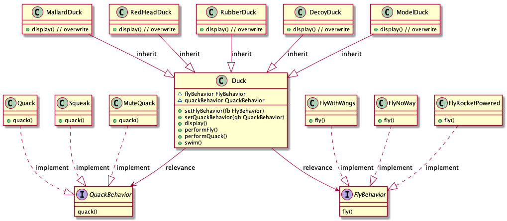
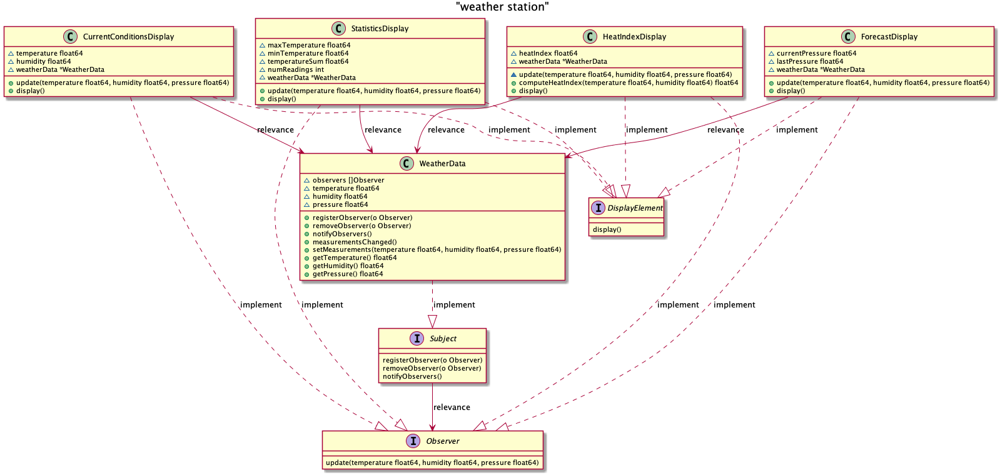

# design-pattern
Implementation of design pattern go language

## content
+ [strategy pattern](#strategy-pattern)
+ [observer pattern](#observer-pattern)

## strategy pattern
+ **define**: The algorithmic family is defined and
	encapsulated separately so that they can be replaced
	each other. This pattern makes algorithmic changes
	independent of the objects using the algorithmic.
+ **type**: behavioral pattern
+ **logical class diagram**:  
	
+ **the structure of strategy pattern**:
	+ **encapsulation class**: Secondary encapsulation of the
	the strategy is to avoid direct invocation of the
	strategy by high-level modules.
	+ **abstract strategy**: Usually, it't an interface.
	When there are repetitive logic in each implementation
	class, abstract classes are used to encapsulate this
	part of common code.
	+ **concrete strategy**: Concrete strategy roles are
	usually assumed by a group of classes encapsulating
	algorithms, which can be freely replaced as needed.
+ **strategy pattern code implementation**:
	+ **[01-strategy](./01-strategy)**
	+ **test result**
		```
		$ go test -v
		=== RUN   TestStrategy
		I'm a real Mallard duck!
		I'am flying     !
		Quack!
		I'm a real Red Headed duck!
		I'am flying     !
		Quack!
		I'm a real Rubber duck!
		I can't fly!
		Squeak!
		I'm a real Decoy duck!
		I can't fly!
		Silence!
		I'm a model duck!
		I can't fly!
		Model duck add rocket power!
		I'm flying with a rocket!
		Quack!
		--- PASS: TestStrategy (0.00s)
		PASS
		ok      design-pattern/01-strategy      0.004s

		```
+ **main advantages of strategy pattern**:
	+ Strategy classes are free switch between them because
	the strategy classes are implemented from the same abstraction.
	+ Easy to extend, adding a new strategy is very easy for
	strategy pattern, and can be extended basically without
	changing the original code.
	+ Avoid using multiple conditions. If you don't use the
	strategy pattern, you must use conditional statements
	to join all algorithms and use conditional judgement to
	decide which algorithm to use. Using multiple conditional
	judgement is very difficult to maintain.
+ **main disadvantages of strategy pattern**:
	+ Maintaining the various strategy classes imposes
	additional overhead on development.
	+ All the strategy classes must be exposed to the client
	(the caller)because it is up to client decide which
	strategies to use, so the client should know what strategies
	are and the differences between them, otherwise the
	consequences can be severs.
+ **applicable scenario**:
	+ The main logic of several class is the same, with only
	minor differences in the algorithm and behavior of partial
	logic.
	+ There are several similar behaviors, or algorithms
	that clients need to dynamically decide which to use,
	and these algorithms can bo encapsulated for clients
	to call using strategy patter.

## observer pattern
+ **define**: A one-to-many dependency between objects is
	defined so that when an object changes state, all its
	dependencies are notified and updated automatically.
+ **type**: behavioral pattern
+ **class diagram**:  
	
+ **the structure of observer pattern**
	+ **subject**: As you can see from the class diagram,
	there is a slice in the interface for the observer object,
	which is the core of the subject interface, and there
	are three methods: The registerObserver method is to add
	observer object to the slice; The removeObserver method
	removes the observer object from the slice; The
	notifyObservers method calls the corresponding methods
	of the observer object in turn. This role can be an 
	interface, an abstract class, or a concrete class, as
	it's often used in conjunction with other patterns.
	+ **observer**: Usually, the observer is an interface
	which only has a update method, when the subject's
	state change that method will be called.
	+ **concrete subject**: The role is used for extensibility,
	where specific business logic can be defined.
	+ **concrete observer**: The implementation of the
	observer interface, in which the logic to be processed
	when the state of subject object changes is defined.
+ **observer pattern code implementation**
	+ **[02-observer](./02-observer)**
	+ **test result**
		```
		$ go test -v
		=== RUN   TestObserver
		Current conditions: 80.00 F degrees and 65.00% humidity
		Avg/Max/Min temperature = 80.00/80.00/80.00
		Forecast: Improving weather on the way!
		Heat index is 82.95535063710001
		Current conditions: 82.00 F degrees and 70.00% humidity
		Avg/Max/Min temperature = 81.00/82.00/80.00
		Forecast: Watch out for cooler, rainy weather!
		Heat index is 86.90123306385205
		Current conditions: 78.00 F degrees and 90.00% humidity
		Avg/Max/Min temperature = 80.00/82.00/78.00
		Forecast: More of the same!
		Heat index is 83.64967139559604
		Observers: *observer.CurrentConditionsDisplay *observer.StatisticsDisplay *observer.ForecastDisplay *observer.HeatIndexDisplay
		--- PASS: TestObserver (0.00s)
		PASS
		ok      design-pattern/02-observer      0.005s
		```
+ **main advantages of observer pattern**
	+ The relationship between subject and observer is light
	and abstractly coupled, making is easier for both to
	extend.
	+ The observer pattern is a common trigger mechanism
	that forms a trigger chain that processes the methods
	of each observer in turn.
+ **main disadvantages of observer pattern**
	+ Performance is a concern when there are many observers.
	In addition, in the chain structure, more prone to circular
	reference error, resulting in system suspended.
+ **applicable scenario**
	+ If you want to design the functionality of an event-triggering
	mechanism, and there is a one-to-many relationship
	between objects, using the observer pattern is a good
	choice.